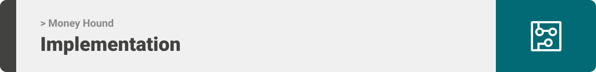

<div align="center">

> Hello world! This is the project’s summary that describes the project plain and simple, limited to the space available.

**[PROJECT PHILOSOPHY](https://github.com/julescript/well_app#-project-philosophy) • [WIREFRAMES](https://github.com/julescript/well_app#-wireframes) • [TECH STACK](https://github.com/julescript/well_app#-tech-stack) • [IMPLEMENTATION](https://github.com/julescript/well_app#-impplementation) • [HOW TO RUN?](https://github.com/julescript/well_app#-how-to-run)**

</div>

<br><br>


> Money Hound is an accounting and project management website that helps companies handle their employees, projects and finances 
>
> There are 2 user types. The owner who can add employees, create projects and moniter the companies finances. The project manager who can be responsible for multiple projects and is able to add colleagues to their team.

### User Stories

- As an idependent business owner, I want to be able to moniter all my companies financial activity from a single place
- As a project manager, I want control over who joins my team and set activities and milestones with a few button clicks, so I would increase productivity

<br><br>


> This design was planned before on paper, then moved to Figma app for the fine details.
> Note that i didn't use any styling library or theme, all from scratch and using pure css modules

| Landing                                                                                | User Companies                                                                               |
| -------------------------------------------------------------------------------------- | ----------------------------------------------------------------------------------------- |
| .png) | .png) |

| Admin Panel                                                                                | Employee table                                                                               |
| ---------------------------------------------------------------------------------------------- | --------------------------------------------------------------------------------------------- |
| .png) |  |

| Project Details                                                                                | Sell project                                                                               |
| ---------------------------------------------------------------------------------------------- | --------------------------------------------------------------------------------------------- |
| .png) | .png) |
<br><br>


Here's a brief high-level overview of the tech stack the Well app uses:

- This project uses the [React library](https://reactjs.org/). React is a free, open-source JavaScript library. It works best to build user interfaces by combining sections of code (components) into full websites.
- This project uses [Express](https://expressjs.com/). A minimal and flexible [Node.js](https://nodejs.org/en/about/) web application framework that provides a robust set of features for web and mobile applications. 
- For persistent storage (database), the app uses the [MySQL](https://dev.mysql.com/doc/)  MySQL is an open-source relational database management system.
<br><br>


> Uing the above mentioned tecch stacks and the wireframes build with figma from the user sotries we have, the implementation of the app is shown as below, these are screenshots from the real app

| Employee Page                                                                                | Projects Page                                                                               |
| -------------------------------------------------------------------------------------- | ----------------------------------------------------------------------------------------- |
| .png) | .png) |

| Project Manger                                                                | Company Owner                                                                               |
| ----------------------------------------------------------------- | ----------------------------------------------------------------------------------------- |
|  |  |

| Insights Page                                                                                | Insights gif                                                                               |
| -------------------------------------------------------------------------------------- | ----------------------------------------------------------------------------------------- |
|  |  |


> This is an example of how you may give instructions on setting up your project locally.
> To get a local copy up and running follow these simple example steps.

### Prerequisites

This is an example of how to list things you need to use the software and how to install them.

- npm
  ```sh
  npm install npm@latest -g
  ```

### Installation

_Below is an example of how you can instruct your audience on installing and setting up your app. This template doesn't rely on any external dependencies or services._


1. Clone the repo
   ```sh
   git clone https://github.com/Khodor-Hassoun/money-hound.git
   ```
2. Install NPM  packages
   ```sh
   npm install
   ```

